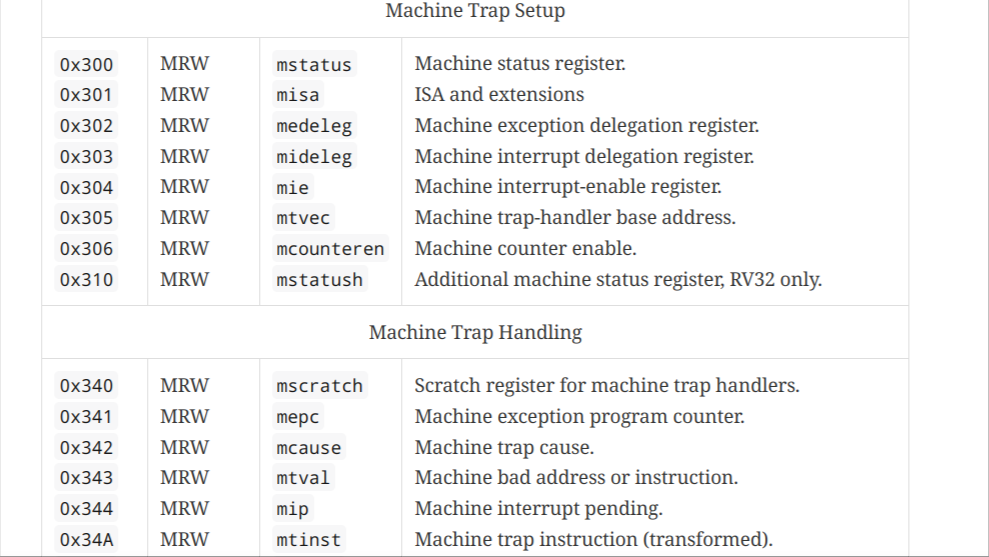

# Table of Contents

1.  [&lt;2024-02-28 三&gt;  &lt;2024-02-29 四&gt;](#orgec1ef4f)
    1.  [为 nemu 添加批处理](#orge233f78)
2.  [&lt;2024-03-01 五&gt;  &lt;2024-03-02 六&gt;](#org17b5a5d)
3.  [备忘录](#org40b3989)

# &lt;2024-02-28 三&gt;  &lt;2024-02-29 四&gt;

一次只能执行一个程序 -> 批处理 -> 分时多任务

CSR registers （control and status registers）

mepc 寄存器 存放异常执行的pc
mstatus 寄存器 存放处理器的状态
mcause 寄存器 存放出发异常的原因

m 的意思是 machine mode

## DONE 为 nemu 添加批处理

-   [X] 修改 cpu 结构体，添加 mepc, mstatus, mcause 寄存器
-   [X] 添加 csrr, csrw, 增加 对特殊寄存器的读写操作
    csrr rd csr 是伪指令，他对应 csrrs rd csr x0, means \`t = CSRs[csr]; CSRs[csr] = t | x[rs1]; x[rd] = t\`
    csrw csr rs1 也是伪指令，他对应 csrrw x0 csr rs1 \`t = CSRs[csr]; CSRs[csr] = x[rs1]; x[rd] = t\`
    
    -   要确定不同特殊寄存器对应的 csr number, 通过查阅 riscv instruction set manual volume II 可知，
    
        标准 RISC-V ISA 为多达 4 096 个 CSR 预留了 12 位编码空间（csr[11:0]）。按照惯例，CSR 地址的高 4 位（csr[11:8]）用于根据权限级别对 CSR 的读写访问能力进行编码，如表 3 所示。前两位（csr[11:10]）表示寄存器是读/写（00、01 或 10）还是只读（11）。接下来的两位（csr[9:8]）表示可以访问 CSR 的最低权限级别。
    
    根据官方文档，为 mepc 和 mstatus, mcause, mtvec 分配的 csr 数值如下

-   [X] 在 nemu 中实现 ecall, mret 指令
    ioeinit -> cteinit (set mtvec to \_amasmtrap, and register user defined function)
    yield -> ecall (提升当前特权等级) -> (硬件/nemu) 应该保存pc，并设置pc为 mtvec 所指向的 异常处理函数 (trap.S)
    	trap.S 主要做的事情是 保存现场 (csr gpr), 然后跳转到 \`\_amirqhandler\`, 这个函数会调用用户注册的中断处理函数。
          目前的问题 \`\_amirqhandler\` 接受一个 context 参数，这个参数是谁传进去的？
           根据 riscv 的函数调用特性，使用 a0 储存第一个函数参数。阅读 汇编代码可得，a0 的值就是 sp，
           而在跳转到 \_amirqhandler 之前，代码将 caller saved 寄存器和 csr 寄存器压入到栈中。
           所以，所有寄存器的值构成了 context 结构体。
          \_amirqhandler 根据 Context 的中 mcause 的取值，来设置 event 类型，回调函数根据 event 类型，做出对应处理
    
        gp,tp,t0,t1,t2,s0,s1,a0,a1,a2,a3,a4,a5,mcause,mstatus,mepc
    
    总结函数调用链如下：
    cteinit (user: set mtvec, userhandler) -> yield -> ecall (nemu) -> 调用 isaraiseintr(save pc to mepc, set mcause) -> \_amasmtrap 将寄存器的值保存到栈中，组成 context 参数 -> \_amirqhandler (根据 mcause 设置 event, 在这里对 epc + 4) -> simpletrap -> \_amasmtrap mret (恢复现场)

PA3.1 暂时结束，目前的问题是，difftest 运行不正常，猜测是向 spike 传入 csr 时出现问题。
（尝试使用 state->mcause->write(), state->mcause->read() 来读写spike 模拟器的 csr 值，但是
从运行的结果上来看，加不加没啥区别。）

# &lt;2024-03-01 五&gt;  &lt;2024-03-02 六&gt;

PA4.1 开始

在 PA3.1 中，我们为 nemu 实现了 yield 操作，实现了批处理操作系统。(batch mode operating system)
批处理操作系统只能按照设定的顺序依次执行程序。只有当一个程序结束执行之后，才会开始执行下一个程序。这也是批处理系统的
一个问题：如果当前程序正在等待输入输出，那么整个系统都会因此而停顿。

在真实的计算机中，和cpu的性能相比，输入输出是非常缓慢的：以磁盘为例，磁盘进行一次读写需要花费大约5毫秒的时间，但是对一个
2G Hz 的cpu 来说，它需要花费 10000000 个周期来等待磁盘操作的完成。

与其让机器无意义的空转，我们不如让机器在等待io的时间运行其他的应用程序，而这就是多道程序的核心思想。

解析 `yield os` 代码

    #include <am.h>
    #include <klib-macros.h>
    
    #define STACK_SIZE (4096 * 8)
    typedef union {
      uint8_t stack[STACK_SIZE];
      struct { Context *cp; };
    } PCB;
    static PCB pcb[2], pcb_boot, *current = &pcb_boot;
    
    static void f(void *arg) {
      // 若 arg == 1 输出 A
      // 若 arg == 2 输出 B
      // 其他输出 ？
      while (1) {
        putch("?AB"[(uintptr_t)arg > 2 ? 0 : (uintptr_t)arg]);
        for (int volatile i = 0; i < 100000; i++) ;
        yield();
      }
    }
    
    // scheduler，进程调度器
    static Context *schedule(Event ev, Context *prev) {
      current->cp = prev; // 将当前进程的上下文保存到当前的 pcb 中
      current = (current == &pcb[0] ? &pcb[1] : &pcb[0]);
      // 切换 pcb
      // 对 current 重新赋值并不会覆盖掉 保存的数据，因为 context
      // 只是一个指针而已。
      return current->cp;
    }
    
    int main() {
      cte_init(schedule);
      pcb[0].cp = kcontext((Area) { pcb[0].stack, &pcb[0] + 1 }, f, (void *)1L);
      pcb[1].cp = kcontext((Area) { pcb[1].stack, &pcb[1] + 1 }, f, (void *)2L);
      yield();
      panic("Should not reach here!");
    }

yield os 程序调度流程图

[yield os 踩坑记录](file:///home/trace/trace/obsidian/随手记/PA4 奇闻录.md)

# 备忘录

XLEN to refer to the ****width**** of an integer register 

在 c 语言中，在 union 里定义的匿名结构体的成员可以被直接访问

    Anonymous structures in C allow us to define structures without naming them, which is particularly useful in nested structures or unions, where naming the inner structure isn’t necessary. They were introduced in the C11 standard, enhancing the language’s flexibility and reducing the need for unnecessary naming.

      #include <stdio.h>
    typedef struct {
        struct {  // Anonymous struct
            int x;
            int y;
        };
        double radius;
    } Circle;
    int main() {
        Circle c;
        c.x = 10;  // Direct access to 'x' and 'y'
        c.y = 20;
        c.radius = 5.0;
        printf("Circle center: (%d, %d), radius: %.1f\n", c.x, c.y, c.radius);
        return 0;
    }

    printf("%x\n", -0x7FFFFF90);

